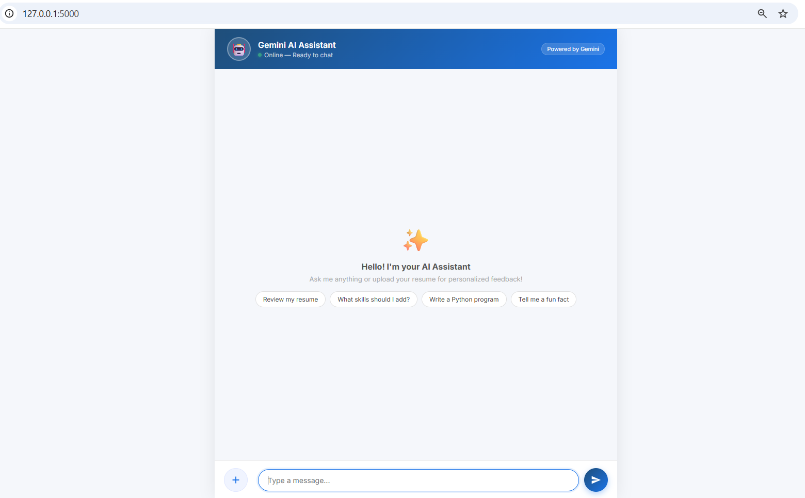
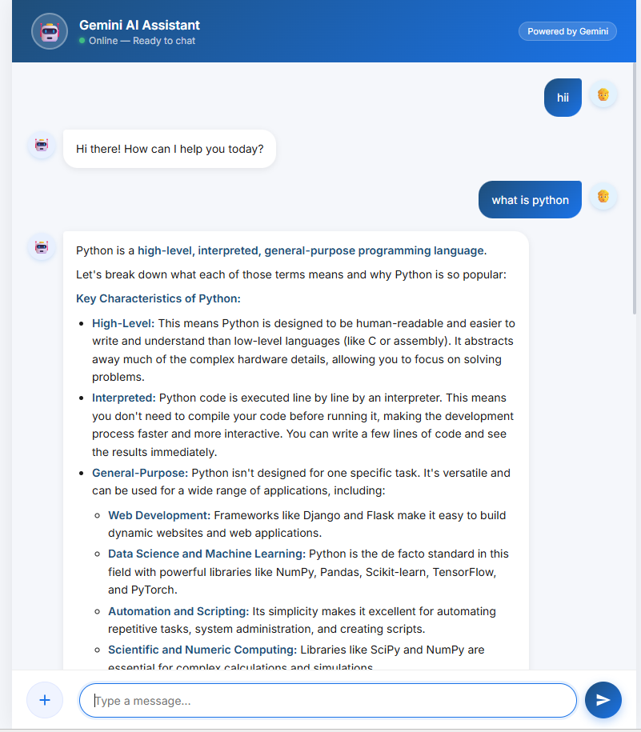

# 🤖 AI Chatbot — Powered by Google Gemini

An AI-powered conversational chatbot built with Python and Flask, 
integrated with Google's Gemini API for intelligent, context-aware responses.

---

## ✨ Features

- 💬 **Multi-turn conversations** — remembers context across the chat session
- 📄 **File upload support** — upload a resume or PDF for personalized AI analysis
- ⚡ **Quick prompt suggestions** — one-click prompts like "Review my resume" 
  and "Write a Python program"
- 🔒 **Secure API key management** — keys stored via environment variables, 
  never exposed in code
- 📱 **Responsive UI** — works seamlessly on desktop and mobile

---

## 🖥️ Screenshots

| Welcome Screen | Chat in Action |
|---|---|
|  |  |

---

## 🛠️ Technologies Used

| Layer | Technology |
|---|---|
| Backend | Python, Flask |
| AI Engine | Google Gemini API |
| Frontend | HTML, CSS, JavaScript |
| Security | python-dotenv |

---

## ⚙️ How to Run Locally

### Prerequisites
- Python 3.8+
- Google Gemini API key ([Get one here](https://makersuite.google.com/app/apikey))

### Steps

```bash
# 1. Clone the repository
git clone https://github.com/Shreya-1101/AI-Chatbot-gemini.git
cd AI-Chatbot-gemini

# 2. Install dependencies
pip install -r requirements.txt

# 3. Create a .env file and add your API key
echo "GEMINI_API_KEY=your_api_key_here" > .env

# 4. Run the app
python app.py

# 5. Open in browser
http://127.0.0.1:5000
```

---

## 🔐 Security

API keys are stored using environment variables and excluded from version 
control via `.gitignore` — no sensitive data is ever committed to the repository.

---

## 👩‍💻 Author

**Shreya Tatar**  
